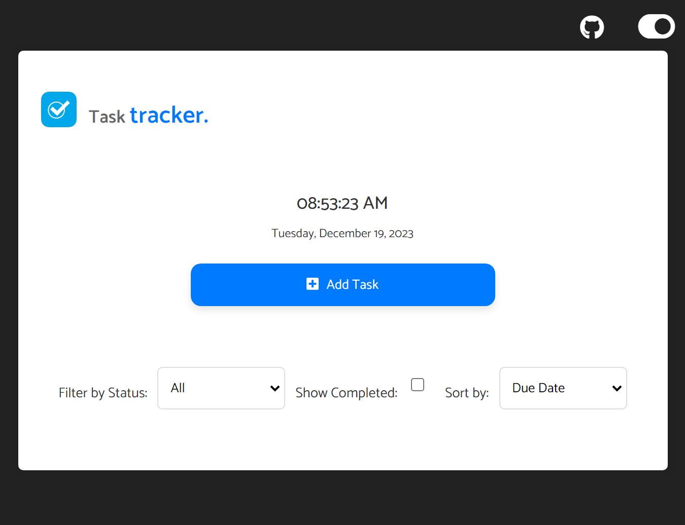

# Task Tracker

Simple and efficient Task Tracker app developed with Node.js, Express.js, and MongoDB. Its frontend, crafted with vanilla JavaScript, seamlessly interacts with the backend, allowing users to manage tasks effortlessly. Focusing on productivity and ease of use.



## Table of Contents

- [Features](#features)
- [Getting Started](#getting-started)
  - [Prerequisites](#prerequisites)
  - [Installation](#installation)
- [Usage](#usage)
- [API Endpoints](#api-endpoints)
- [Frontend](#frontend)
- [Backend](#backend)
- [User Authentication](#user-authentication)
- [Contributing](#contributing)
- [Blog Post](#blog-post)
- [License](#license)

## Features

- **User Management**: Register and login securely.
- **Task Management**: Perform CRUD operations on tasks, including adding, updating, and deleting.
- **Forgot Password**: Request a temporary password via email if forgotten.
- **Responsive Design**: Works seamlessly on desktop and mobile devices.
- **Dark Mode**: Enjoy a comfortable viewing experience, even in low light environments.

## Getting Started

### Prerequisites

Before you begin, ensure you have the following tools installed:

- Node.js and npm
- MongoDB

### Installation

1. Clone the repository:

   ```bash
   git clone https://github.com/lebogangolifant/task-tracker.git
   ```

2. Install dependencies:

   ```bash
   cd task-tracker
   npm install
   ```

3. Set up MongoDB:

   - Make sure MongoDB is running.
   - Create a `.env` file in the project's root directory.
   - Add your MongoDB connection string to the `.env` file: 

     ```
     MONGO_URI=your-mongodb-connection-string
     ```

     Replace `your-mongodb-connection-string` with your actual MongoDB connection string.


## Usage

1. Start the server:

   ```bash
   npm start
   ```
2. Navigate to
    ```bash
   http://localhost:3000/tasks
   ```
   in your browser to see data stored in  JSON files.

3. Open the web application ``index.html`` file in your browser.

4. Add, manage, and track your tasks!

## Tasks API Endpoints

- **GET /tasks**: Retrieve all tasks.
- **GET /tasks/:taskId**: Retrieve a specific task by ID.
- **POST /tasks**: Add a new task.
- **PUT /tasks/:taskId**: Update an existing task.
- **DELETE /tasks/:taskId**: Delete a task.


#### **Example JSON for a Task:**
```json
{
  "_id": 1,
  "title": "Complete Project Proposal",
  "description": "Write a detailed project proposal for submission.",
  "due_date": "2023-11-28",
  "status": "pending"
}
```

## Frontend

- Built with HTML5, CSS3, and JavaScript.
- Utilizes the Fetch API for communication with the backend.

## Backend

- Built with Node.js and Express.
- Uses Mongoose for MongoDB integration.

## User Authentication

This version includes user authentication using JWT (JSON Web Tokens). 

### Authentication API Endpoints

- **POST /register**: Register a new user.
- **POST /login**: Login an existing user.

### Password Management API Endpoints

- **POST /forgot-password**: Request a temporary password via email.

## Contributing

Contributions are welcome! Please follow the [contribution guidelines](CONTRIBUTING.md).

## Blog Post

An in-depth look at the [project development process](https://bit.ly/task_tracker_blog)

## License

This project is licensed under the [MIT License](LICENSE).
